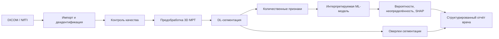

# Hydrocephalus MRI AI

Исследовательская платформа для разработки Windows-приложения, которое анализирует МРТ головного мозга, извлекает количественные нейровизуализационные признаки и оценивает вероятность идиопатической нормотензивной гидроцефалии (иНТГ) и клинически значимых дифференциальных состояний.

> [!IMPORTANT]
> Репозиторий содержит архитектуру и план реализации. Исполняемого приложения и валидированной модели пока нет. Будущий результат предназначен для поддержки решения врача, а не для автономной постановки диагноза, назначения лечения или определения показаний к операции.

## Основание проекта

Структура подготовлена по выводам обзора `iNPH_review_V26_1.docx` от 7 июля 2026 года. Из обзора в проект перенесены следующие требования:

- предпочтительна гибридная схема: DL-сегментация → количественные МРТ-признаки → интерпретируемая ML-классификация;
- базовые признаки: индекс Эванса, угол мозолистого тела, объём желудочковой системы, qDESH/DESH-показатели, расширение сильвиевых щелей, сужение высококонвекситальных парафальцинарных борозд и показатели кортикальной морфометрии;
- Venthi, Sylhi и другие нестандартизированные производные должны маркироваться как исследовательские;
- клинически значимые группы сравнения включают болезнь Альцгеймера, сосудистую деменцию, заместительную гидроцефалию и смешанные формы;
- ТАП-тест, инфузионные тесты и послеоперационный ответ допустимы как критерии верификации, но не как входные признаки MRI-only модели;
- необходимы независимая внешняя и затем проспективная многоцентровая валидация.

Подробная трассировка требований находится в [клиническом README](docs/clinical/README.md).

## Целевой сценарий

1. Пользователь импортирует DICOM-серию или исследовательский NIfTI-файл.
2. Приложение удаляет идентификаторы из рабочей копии и проверяет качество/совместимость данных.
3. Конвейер нормализует 3D МРТ, сегментирует анатомические структуры и рассчитывает количественные признаки.
4. Интерпретируемый классификатор возвращает вероятности классов, оценку неопределённости и причины результата.
5. Врач просматривает исходные серии, маски, измерения и структурированный отчёт; итоговое решение остаётся за врачом.

Вход MVP разделён на два уровня. Базовый уровень — рутинные 2D-серии (T1/T2/FLAIR), на которых доступны только линейные измерения. Расширенный уровень — неконтрастная структурная 3D T1-взвешенная МРТ, обязательная для DL-сегментации, объёмных признаков и DESH-компонентов. Разделение продиктовано составом реальной ретроспективной выборки; определения уровней и их следствия для признаков — в [клиническом README](docs/clinical/README.md).

## Планируемая архитектура



- **Windows-клиент:** .NET LTS + WPF, MVVM, локальный просмотрщик и мастер анализа.
- **Прикладной слой:** сценарии импорта, анализа, отмены, аудита и экспорта отчёта.
- **Инференс:** ONNX Runtime в локальном процессе; CPU обязателен, совместимый GPU — опционально.
- **ML-контур:** Python, MONAI/PyTorch для обучения и валидации; приложение получает только версионированный ONNX-пакет.
- **Данные:** обработка локально по умолчанию; исходные DICOM и PHI не попадают в репозиторий, телеметрию или журналы.

Подробнее: [архитектура](docs/architecture/README.md), [Windows-клиент](docs/windows/README.md), [ML](docs/ml/README.md).

## Структура репозитория

```text
.
├── src/
│   ├── Hydrocephalus.Desktop/        # WPF UI и визуализация
│   ├── Hydrocephalus.Application/    # пользовательские сценарии
│   ├── Hydrocephalus.Domain/         # доменная модель и контракты
│   ├── Hydrocephalus.Infrastructure/ # DICOM, хранение, отчёты, аудит
│   └── Hydrocephalus.Inference/      # ONNX и конвейер инференса
├── ml/                               # обучение, экспорт и model cards
├── data/                             # только схемы и синтетические примеры
├── models/                           # правила публикации моделей
├── tests/                            # стратегия тестирования
├── tools/                            # воспроизводимые служебные утилиты
└── docs/                             # продуктовые и инженерные решения
```

Каждая папка содержит README с границами ответственности и критериями готовности.

## Этапы реализации

1. **Foundation:** solution-файл, WPF shell, CI, форматирование, логирование без PHI.
2. **Imaging:** импорт DICOM/NIfTI, деидентификация рабочей копии, просмотр серий и QC.
3. **Segmentation:** воспроизводимая предобработка, ONNX-инференс, оверлеи и Dice-тесты.
4. **Biomarkers:** индекс Эванса, угол мозолистого тела, объёмы и DESH-компоненты с единицами и provenance.
5. **Classification:** калиброванная MRI-only модель, SHAP/вклад признаков, неопределённость и отказ от ответа.
6. **Validation:** patient-level split, внешняя выборка другого центра, отчётность CLAIM/TRIPOD и оценка PROBAST.
7. **Windows release:** подписанный установщик, SBOM, офлайн-режим, эксплуатационная документация.

Детальный порядок — в [дорожной карте](docs/roadmap.md).

## Что считается безопасным результатом MVP

Отчёт MVP должен показывать:

- версию модели и полный статус входного QC;
- рассчитанные признаки с единицами и допустимыми диапазонами;
- вероятности только для классов, на которых модель обучена и валидирована;
- доверительный интервал или иную оценку неопределённости;
- причины результата и визуальные маски для проверки врачом;
- явное предупреждение при неполных/неподходящих данных или сдвиге распределения;
- фразу о том, что результат не является диагнозом.

## Навигация

- [Документация](docs/README.md)
- [Клиническая постановка](docs/clinical/README.md)
- [Данные](docs/data/README.md)
- [Архитектура](docs/architecture/README.md)
- [ML-конвейер](docs/ml/README.md)
- [Валидация](docs/validation/README.md)
- [Windows и поставка](docs/windows/README.md)
- [Безопасность и приватность](docs/security/README.md)
- [Журнал решений (ADR)](docs/decisions/README.md)
- [Участие в разработке](CONTRIBUTING.md)

## Лицензия

Лицензия пока не выбрана. До появления файла `LICENSE` использование кода и материалов регулируется авторским правом владельца репозитория.
