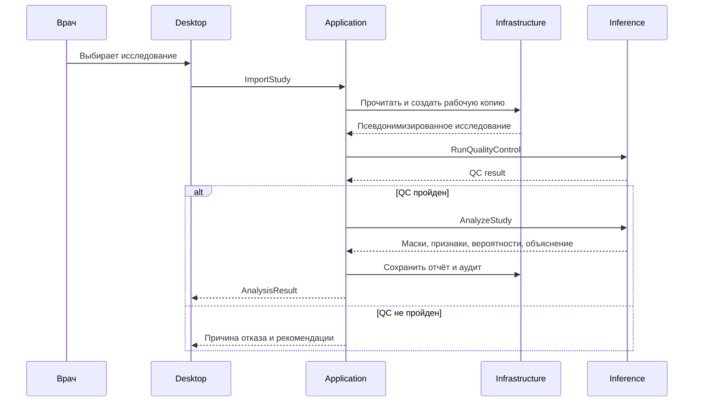

# Архитектура

## Принципы

- локальная обработка и privacy by design;
- воспроизводимый, версионированный конвейер вместо скрытой логики UI;
- клиническая интерпретируемость важнее максимальной внутренней AUC;
- отказ от ответа является корректным результатом;
- компоненты зависят от абстракций доменного слоя;
- обучение и клинический инференс разделены.

## Компоненты

| Компонент | Ответственность | Не отвечает за |
|---|---|---|
| `Desktop` | UI, навигация, просмотр серий и оверлеев | медицинские вычисления |
| `Application` | сценарии импорта, анализа, отмены, экспорта | детали WPF/ONNX/DICOM |
| `Domain` | сущности, статусы, контракты и инварианты | ввод-вывод и фреймворки |
| `Infrastructure` | DICOM/NIfTI, локальное хранение, отчёты, аудит | принятие медицинского решения |
| `Inference` | предобработка, ONNX, признаки, QC/OOD | обучение модели |
| `ml` | обучение, оценка, экспорт и model card | UI и обработка PHI в приложении |

## Поток выполнения



## Границы процесса

Для MVP инференс запускается локально. Долгие операции должны быть отменяемыми, иметь таймаут и возвращать прогресс. Падение модели не должно завершать UI-процесс или оставлять незашифрованные временные данные.

Рекомендуемый путь реализации:

1. сначала in-process ONNX Runtime за интерфейсом `IInferenceEngine`;
2. при необходимости изоляции GPU/нативных зависимостей — локальный worker с именованными каналами;
3. удалённый сервис допускается только отдельным решением с анализом PHI, угроз и регуляторных требований.

## Контракт model package

```text
model-package/
├── manifest.json
├── segmentation.onnx
├── classifier.onnx         # либо строго версионированный ML-артефакт
├── preprocessing.json
├── features.schema.json
├── labels.json
├── calibration.json
├── model-card.md
└── checksums.sha256
```

`manifest.json` связывает версии моделей, предобработки, схемы признаков, порогов QC/OOD и минимальную версию приложения. Пакет загружается только после проверки схемы, подписи/хешей и совместимости.

## Наблюдаемость

События аудита: импорт, результат QC, запуск/отмена анализа, версия модели, экспорт отчёта и ошибка. Запрещено записывать пиксельные данные и исходные DICOM-теги в логи. Техническая телеметрия выключена по умолчанию.

## Открытые решения

Решения по DICOM-библиотеке, визуализатору, формату отчёта, шифрованию локального кэша и стратегии обновления model package оформлены как ADR 0003, 0007, 0005, 0006 и 0008 — см. [журнал решений](../decisions/README.md). Все они в статусе `proposed` и требуют утверждения до старта M1.
